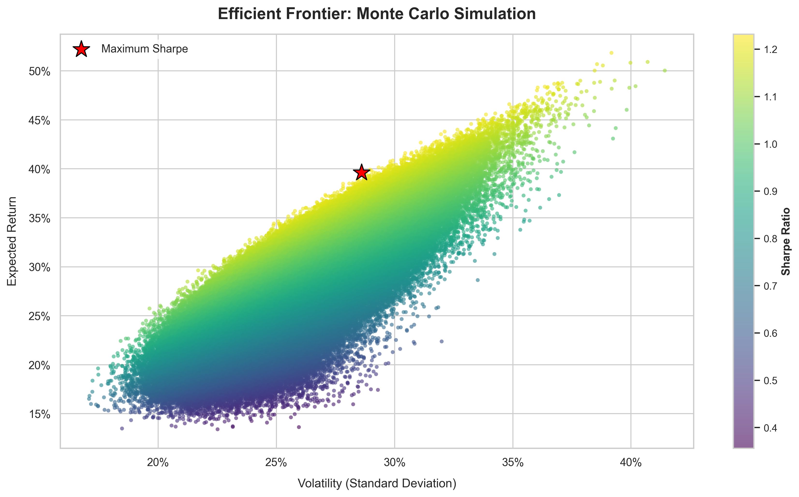

# Portfolio Optimization: Monte Carlo Simulation

**Author:** Michael Owen A.  
**Date:** June 2026  

---

## Overview
This repository implements Modern Portfolio Theory (MPT) to model and optimize asset allocation using a vectorized Monte Carlo framework. By executing 500,000 simulated portfolio weight permutations, the engine maps out the Efficient Frontier and isolates the optimal allocation that maximizes risk-adjusted returns (the Maximum Sharpe Ratio).

The asset universe analyzed includes: AAPL, MSFT, GOOG, AMZN, NVDA, AVGO, and BRK-B over a 5-year historical horizon.

---

## Simulation Results

The model successfully converged to identify an optimal risk-adjusted allocation, plotted below using a clean, modernized Seaborn theme.

### Key Performance Metrics
* **Risk-Free Rate ($R_f$):** 4.38% (via ^TNX Live Ticker)
* **Max Sharpe Ratio:** 1.2320
* **Expected Annualized Return:** 39.62%
* **Annualized Portfolio Volatility:** 28.60%

### Optimal Asset Allocation
* **AVGO:** 33.17%
* **BRK-B:** 30.12%
* **NVDA:** 24.97%
* **GOOG:** 10.66%
* **MSFT:** 0.70%
* **AAPL:** 0.35%
* **AMZN:** 0.02%

---

## Mathematical Framework

Portfolios are mathematically evaluated based on standard quantitative finance formulations:

* **Expected Portfolio Return $E(R_p)$:** The inner product of the weight vector and the historical annualized asset returns.
  $$E(R_p) = \sum_{i=1}^{n} w_i E(R_i)$$

* **Portfolio Volatility $\sigma_p$:** Computed using the covariance matrix $\Sigma$ to capture inter-asset dynamics, annualized over a 252-day trading year.
  $$\sigma_p = \sqrt{w^T \Sigma w} \times \sqrt{252}$$

* **Sharpe Ratio:** Evaluates the premium earned per unit of total risk over the risk-free rate benchmark.
  $$\text{Sharpe Ratio} = \frac{E(R_p) - R_f}{\sigma_p}$$

---

## Instructions for Execution

### 1. Prerequisites
Ensure you have the required stack installed via pip:
`pip install yfinance numpy pandas matplotlib seaborn`

### 2. Running the Notebook
Open and run all cells within the Jupyter Notebook to pull live historical close prices from the Yahoo Finance API, auto-fetch the current 10-year Treasury yield for the risk-free rate, execute the vectorized simulation, and export the high-resolution visualization:
`efficient_frontier_mcs.ipynb`
